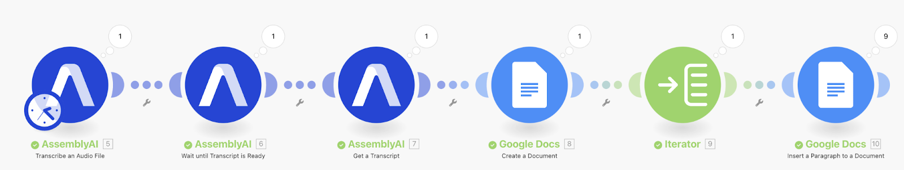
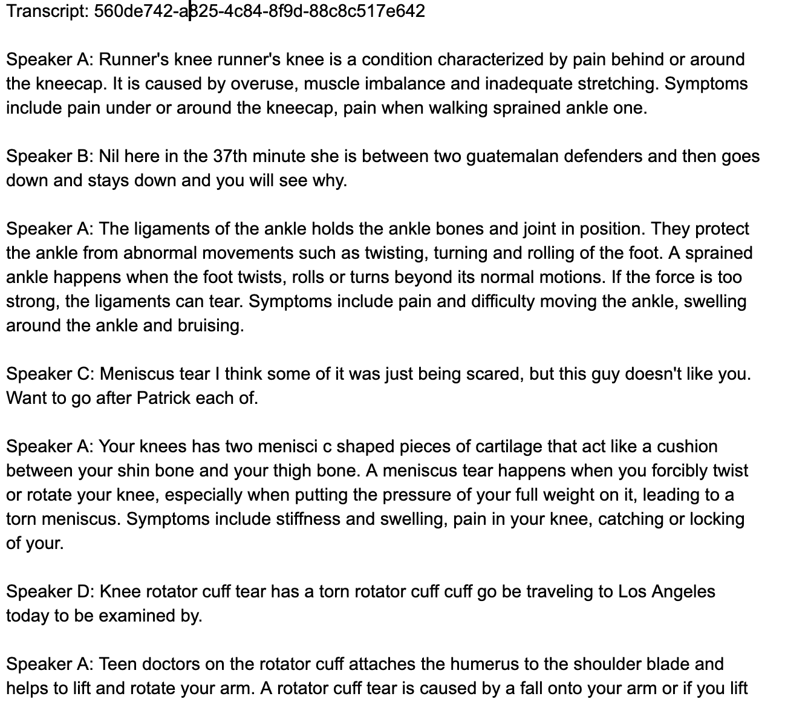
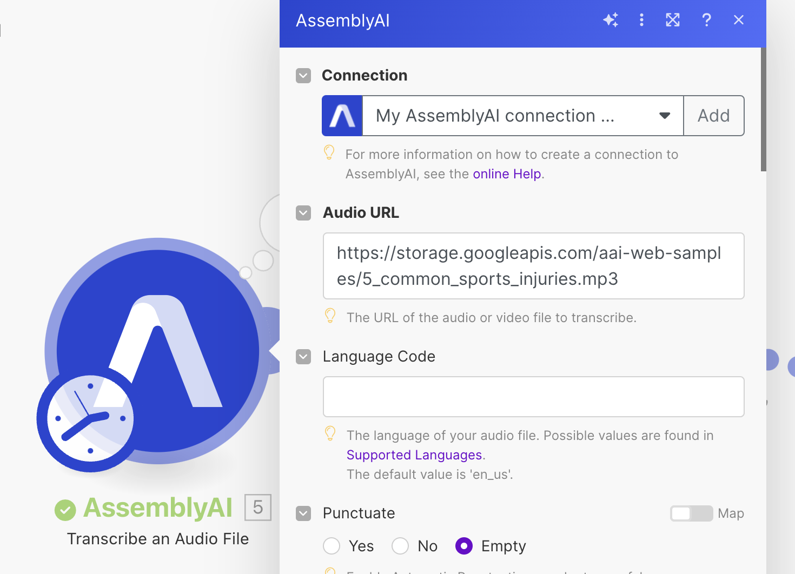
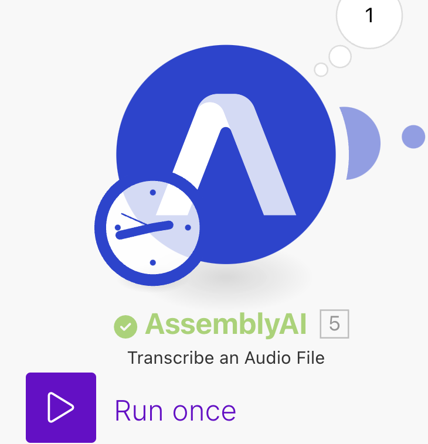
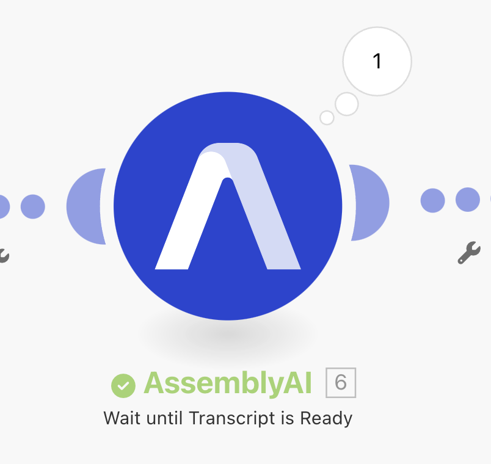
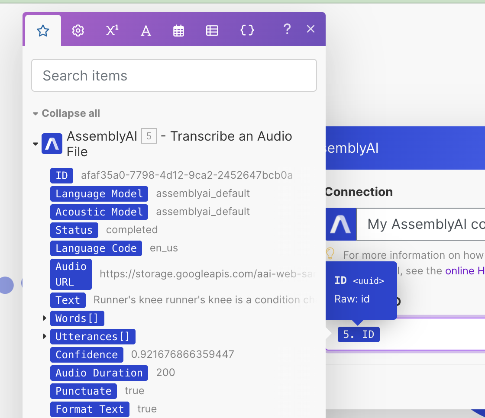
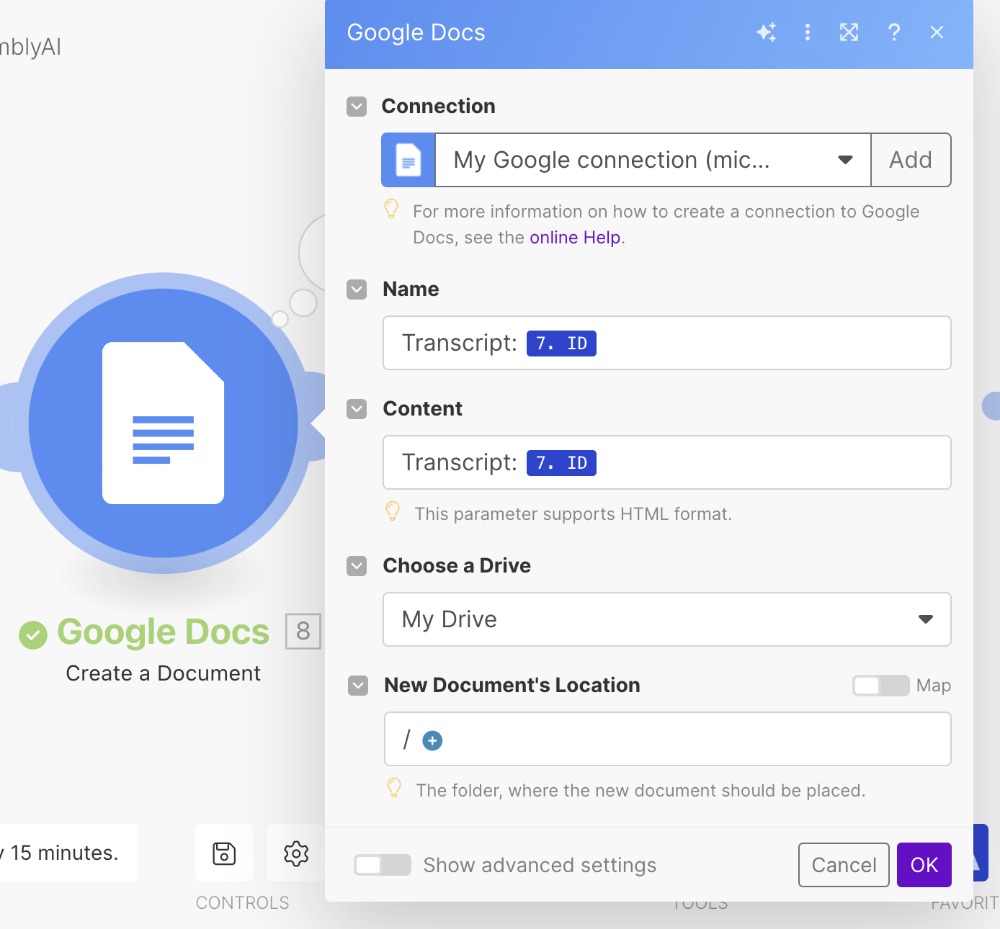
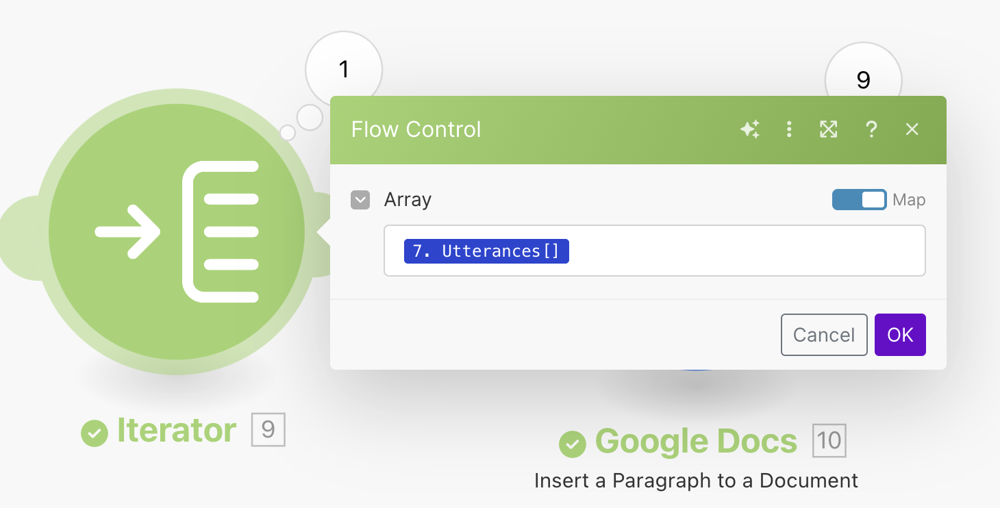
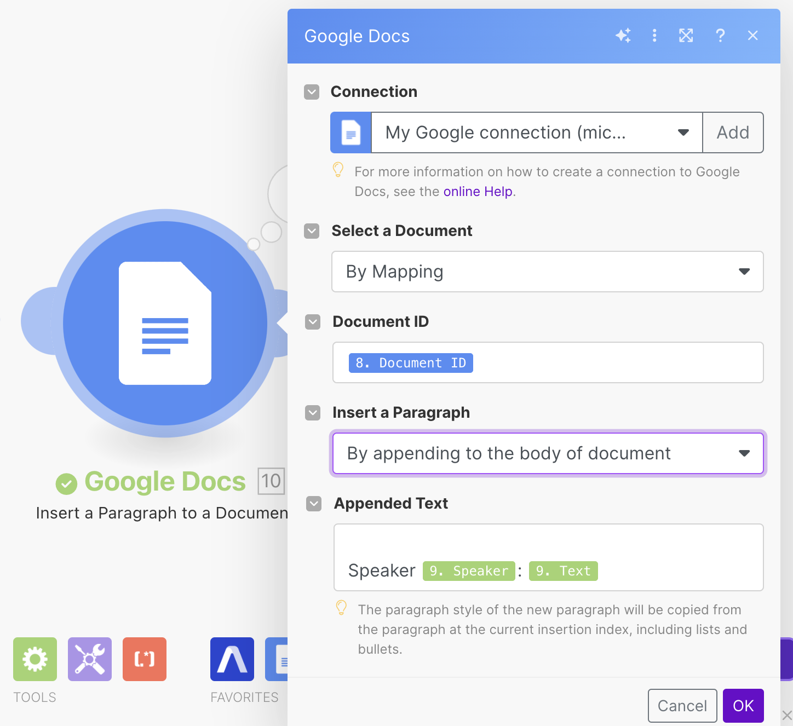

# Iterate over Speaker Labels with Make.com

## Introduction

This is a quick guide on how to iterate over speaker labels in Make.com. This guide will return speaker labels as a readable format to a Google Doc. The end result will look like the two images below.

#### Make.com Scenario:

#### Google Doc Transcript:

## Instructions

### Step 1: Transcribe the Audio
Create a scenario in Make.com. Add a new module. Search for and select the AssemblyAI app and select the "Transcribe an Audio File" module. Add an audio URL. Select speaker labels and other models you’d like to run. 

### Click Run once to retrieve data.

### Step 2: Wait for Completion
Next, add the “Wait until Transcript is Ready” module.

### Select "ID" from the “Transcribe an Audio” module as input for the Transcript ID field.

### Step 3: Get a Transcript
Next, add the “Get a Transcript” module and select "ID" from the “Transcribe an Audio” module as input for the Transcript ID field.

### Step 4: Create a Document
Search for and add the Google Docs app. From there choose the “Create a Document” module. Connect your Google account and name the Doc what you’d like. Add some filler content as well. Additionally, choose where you’d like the Doc to be located.

### Step 5: Iterator Tool
Add the Iterator tool next. The speaker label data is in the utterances array. Select that array as input from the “Transcribe an Audio File" module. This tool will be used to perform a task for each utterance in the array. The next module will repeat its action for each utterance.

### Step 6: Write Speaker Labels Data to Google Doc
Add a module and choose the “Insert a Paragraph” module from Google Docs. Connect your Google account if it’s not already connected (you may have to reconnect it if you get a failed to load error). In the “Select a Document” drop-down, choose "by mapping". In the Document ID input field select document ID from the “Create a document” module. For appended text, you can follow the format below for a readable format.

### Step 7: Run the Scenario.
Run the scenario and you should get a Google Doc in your Drive with the speaker labels included.

