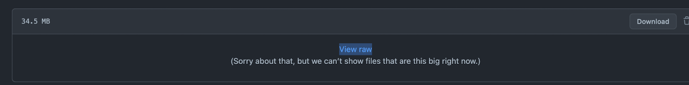

## **Transcribing Files Hosted on GitHub with AssemblyAI**

### Step 1: Upload Your Audio Files to a Public GitHub Repository

- **File Requirements**: GitHub has a file size limit of 100MB so ensure your audio files are 100MB in size or less. The files must be in a public repository otherwise you will receive an error saying the file is not publicly accessible. For a more secure way to host files check out our [Transcribing from an S3 Bucket Cookbook](transcribe_from_s3.ipynb).

### Step 2: Obtain the Raw Audio URL from GitHub

1. Navigate to the repository that houses the audio file. 
2. Click on the audio file. On the next page, right-click the "View raw" link and select "copy the link address" from the context menu.



Downloadable file URLs are formatted as `"https://github.com/<github-username>/<repo-name>/raw/<branch-name>/<file-name-and extension>"`

### Step 3: Add the Audio URL to your Request

``` 
POST v2/transcript endpoint

{
    "audio_url":"https://github.com/user/audio-files/raw/main/audio.mp3"
}
```

``` 
Python SDK

transcript = transcriber.transcribe("https://github.com/user/audio-files/raw/main/audio.mp3")
```

``` 
Typescript SDK

const transcript = await client.transcripts.transcribe("https://github.com/user/audio-files/raw/main/audio.mp3")
```

### **Resources**
[AssemblyAI's Supported File Types](https://www.assemblyai.com/docs/concepts/faq) <br/>
[Transcribe an Audio File](https://www.assemblyai.com/docs/getting-started/transcribe-an-audio-file)
